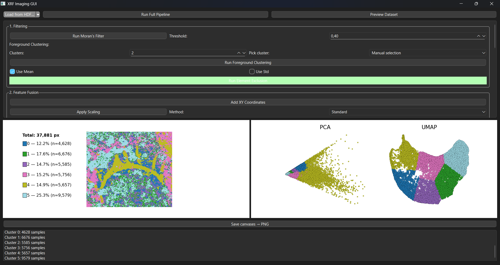
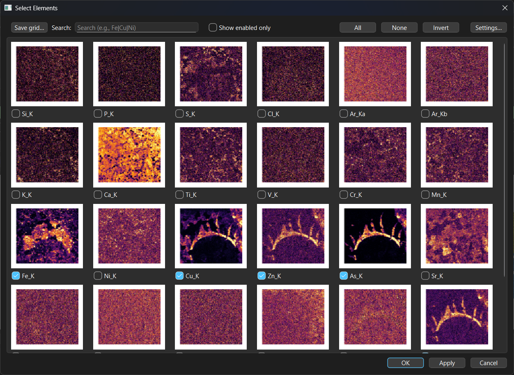
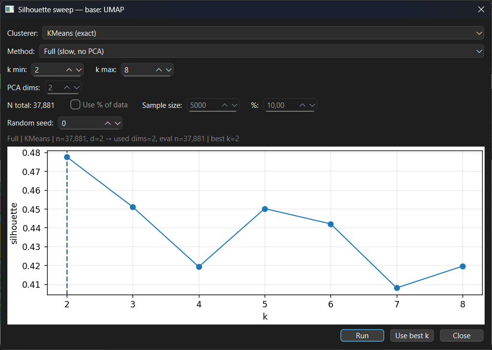
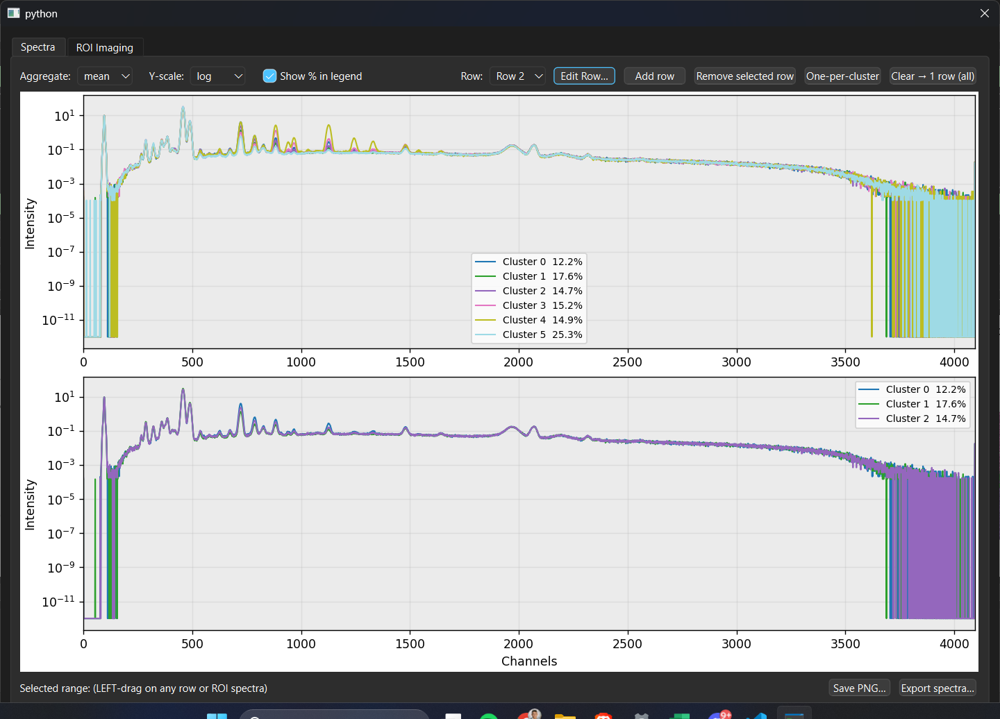
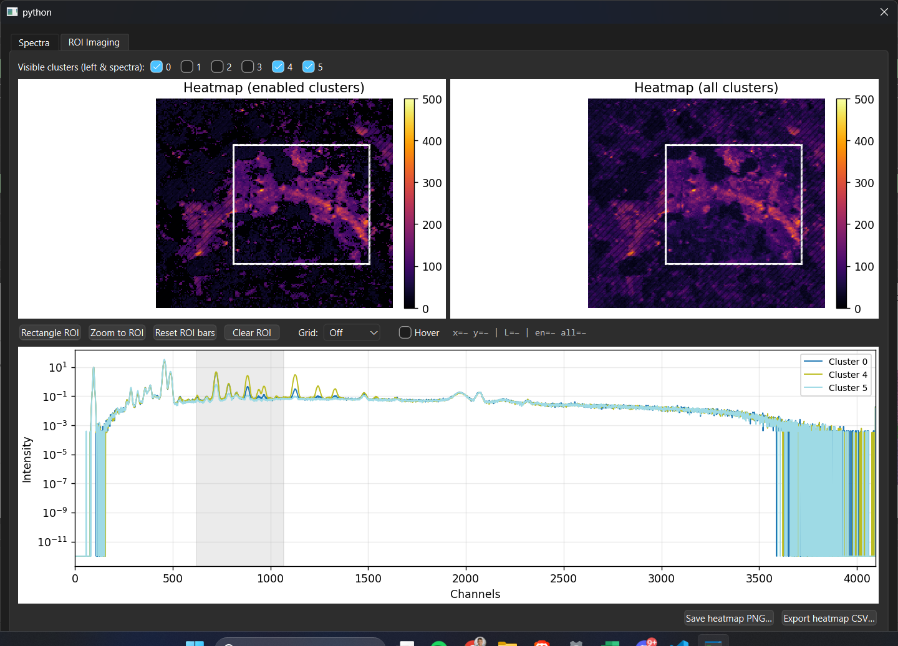
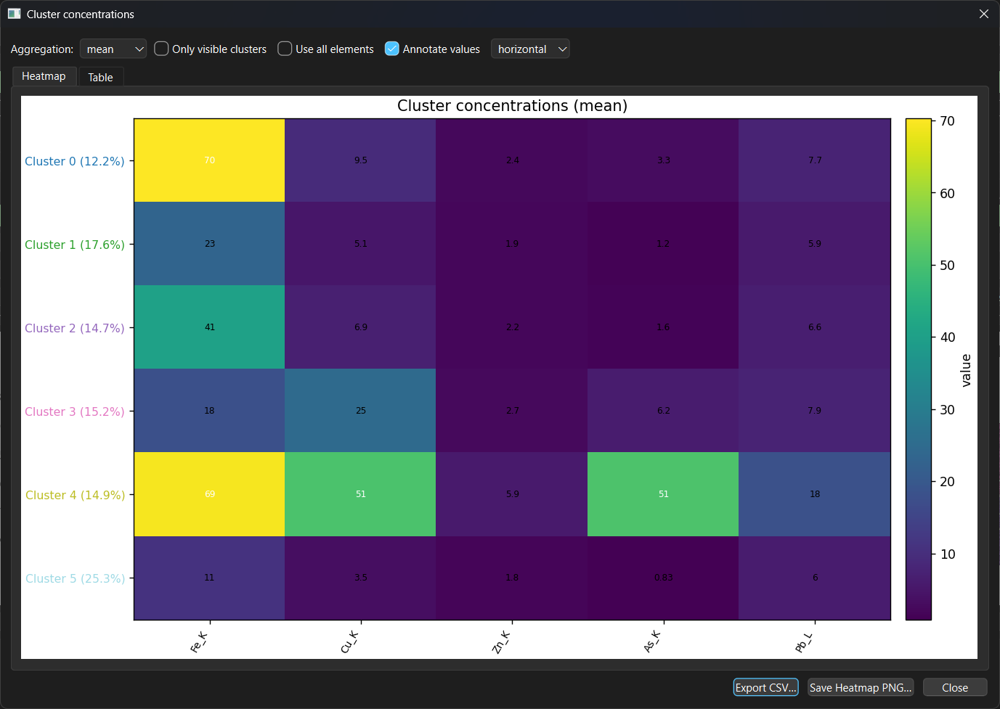

# XRF Imaging GUI

An open-source desktop app for **interactive clustering and exploration of X-ray fluorescence (XRF) maps and spectra**—built to be reliable, transparent, and easy to use.

With a point-and-click GUI, you can load datasets, preprocess (scaling, optional spatial filtering), project to low-dimensional embeddings, run clustering, and immediately **see clusters on the scan** while inspecting **per-cluster spectra** and **element relative concentrations**. The interface favors clarity (legends, outlines, color control) and reproducibility (explicit parameters, predictable exports, and no hidden sorting).

## ✨ Highlights

- **Two synced canvases**
  - Left: image view with cluster colors, outlines, and a compact legend.
  - Right: projection scatter(s) (PCA / NMF / t-SNE / UMAP). Clicking highlights corresponding points.

- **Projections with control**
  - PCA, NMF, t-SNE (perplexity), and **UMAP** with a **metric picker** (euclidean, manhattan, canberra, cosine, mahalanobis, w/weighted minkowski, seuclidean, etc.).
  - Per-metric options dialog for required kwargs (e.g., Mahalanobis VI, wMinkowski p & weights, seuclidean variances).

- **Clustering & quality**
  - K-means on your chosen **base** (raw/filtered dataset or any projection).
  - Quality aids: **Silhouette** interactive module and **Davies–Bouldin** sweeps to help pick *k*.

- **Spectra module (with ROI)**
  - Two tabs: **Spectra** and **ROI Imaging**, plus a global ROI bar.
  - Spectra tab: normal / log / custom scaling; preset layouts (“all clusters in one row” or “one row per cluster”) and editable rows to choose which clusters to compare.
  - ROI tab: two canvases—**visible clusters** vs **all clusters**—with an interactive ROI rectangle that updates the spectra.
  - Navigation: **right-click** to zoom, **double right-click** to reset.
  - One-click CSV/Excel export honoring Sum/Mean, cluster visibility, and current colors.

- **Concentration heatmaps**
  - Mean/median/sum by (cluster × element); toggle **visible clusters only** and **all vs filtered elements**.
  - Inline annotations, colored y-labels by cluster color, PNG/CSV export.

- **Element map**
  - Fast grid of per-element images with search, “apply without closing,” and display controls:
    colormap, linear/log scaling (ε), **per-image** or **global** min/max or percentile normalization.

- **Data handling**
  - HDF5 dataset picker (lists path, shape, dtype, compression) + CFG selection for PyMca fast linear fit.
  - Dataset preview dialog (no implicit resorting) + full-dataset CSV export.
  - **Cached Moran’s I** (computed once, reused) and **streamed spectra** to keep RAM predictable.

- **One-click figures**
  - Save the **two canvases side-by-side** to PNG (renderer capture, DPI-agnostic).

---

## 📦 Tech Stack

Python, **PySide6 (Qt)**, NumPy/Pandas, scikit-learn, **umap-learn**, Matplotlib, h5py, **PyMca5**, libpysal + esda.

---

## 🔧 Installation

We recommend a fresh virtual environment.

```bash
# 1) create & activate
python -m venv .venv
# or: conda create -n xrf-gui python=3.10 && conda activate xrf-gui
. .venv/Scripts/activate  # on Windows
# source .venv/bin/activate  # on macOS/Linux

# 2) install deps
pip install -U pip
pip install PySide6 numpy pandas matplotlib scikit-learn umap-learn h5py libpysal esda PyMca5
```

> **Note:** `PyMca5` provides the fast linear fit used to convert HDF5 + CFG → elemental intensities. If you already have PyMca installed system-wide, ensure the Python package is available on your path.

---

## ▶️ Run

```bash
python xrf_GUI_test.py
```

---

## 🗂 Data workflow

1. **Load** → pick the `.h5/.hdf` file and your `.cfg` fit configuration.  
   Use the **dataset picker** to select the HDF5 dataset path (the dialog shows path, shape, dtype, compression, size).  
   The app runs PyMca’s fast linear fit and builds an elemental table with `X`, `Y`, and columns for each element. Be carefull as the default selection is **No Weights**.
   Alternatively, load a previously exported images.csv from PyMca to bypass fitting.
   
   If the PyMca takes way too long or get any errors regarding your RAM, consider splitting the file with the hdf_splitter.py. Simply run the .py file and open the hdf file you want to split through it. Make sure to also select the correct dataset. You'll find some options where keeping the defaults should be fine. If you do want to experiment, you can set the range of channels (changing this might cause some issues with the .cfg file), the preview stride and the scale. If you file is way too big and computing the preview takes too long, consider increasing the preview stride, which will probably lead to faster computations but a lower resolution.
   To crop the file, by default you can define a rectangle. You can also choose to separate the file into equal parts with a modular grid. The number of vertical/horizontal lines is a parameter and they are also movable, meaning you can drag them along the axis to create tiles of your liking. The MB/tile is more of way to kind of calculate how many tiles you need for a set target MB per tile (take the MB predictions with a pinch of salt). After all that, just click export.

2. **Preview** → confirm the dataframe (first 200 rows shown for speed), optionally export the full CSV.
    The preview reflects the current base used for projections or clustering.

3. **Filter (optional)** 
    → **Moran’s I** filter to keep spatially coherent elements. Results are cached; re-runs avoid recomputation. Set the Moran's I value to 0, in order to see the list of scores.
    → **Foreground Clustering** clusters on per-element mean/std to attemp on separating foreground vs background.
    → **Element map** manually select which elements participate in clustering.

4. **Feature fusion (optional)**
   - **Add XY** coordinates into the feature matrix (toggle on/off). Adds the coordinates as features, scaling after is recommended.
   - **Scale** (Standard/MinMax).
   - **Augment**: build a fused dataset with separate scalers and weights for elements vs XY.

5. **Projections** → choose components and methods; for UMAP select a **metric** (with per-metric options if needed).

6. **Clustering** → choose *k* clusters, choose the **base** (dataset or any projection), and run K-means.
   - Check **Silhouette**/**DB** curves to choose a sensible *k*. DB is faster but Silhouette is built within a module that can significantly reduce the time needed. Within the module, the user can choose to run the silhouette score on a sample/percentage of the dataset. There is also the option to decrease dimentionality or use MiniBatchKMeans.

7. **Inspect**
   - Left canvas: cluster outlines, legend, visibility toggles, color editor.
   - Right canvas: projections; click to de-highlight points.

8. **Analyze**
   - **Spectra ROI**: Spectra tab - view and compare each cluster spectra. ROI tab - interactive ROI module with 2 canvases to compare with ROI and without ROI, for research purposes.
   - **Cluster concentrations**: heatmap (mean/median/sum), annotations, visible-only or all elements, PNG/CSV export.

9. **Export figures** → **Save canvases → PNG** (side-by-side).

---

## 🖱️ UI map (quick)

- **Top bar**: Load / Preview / Run Full Pipeline.  
- **Configuration**:  
  1. Filtering (Moran’s filter, foreground clustering, element exclusion).  
  2. Feature fusion (Add XY, Scaling, Augmented dataset + weights).  
  3. Projections (PCA/NMF/t-SNE/UMAP + UMAP metric dropdown & options).  
  4. Clustering (base selector, *k*, run; Silhouette/DB; color editor; spectra & concentrations).  
- **Canvases**: Left (image + legend), Right (projection).  
- **Bottom**: “Save canvases → PNG” and log output.

---

## 🔍 Reproducibility & trust

- The dataset preview **does not resort** your data; XY indices and element rows match the HDF5 order.
- Pipeline choices are explicit and logged (scalers, weights, projection metrics, *k*).
- **Spectra** always come from the **original HDF** stack (sum or mean as selected), not from scaled features.
- **Moran’s I** results are cached and keyed to your grid size; re-runs reuse prior scores when valid.

---

## 🧪 Tips & known quirks

- **UMAP metrics**:  
  - `wminkowski` requires a weight vector length equal to the number of active features; the app validates this and will fall back to equal weights if mismatched.  
  - Metrics like **Canberra** can be sensitive to zero rows or near-constant features; if you see an outlier run, check for zero-variance columns or try a different metric.
- **OpenGL/Qt drivers**: on a few Windows setups, forcing software rendering helps with embedded Matplotlib widgets. If needed:  
  Set `QT_OPENGL=software` before launching.
- **Memory**: the app stores the **path** to the raw HDF5 dataset and streams spectra for cluster plots to keep RAM stable. if the hdf file is bypassed, importing the hdf file might be needed.

---

## 📸 Screenshots

### Main Window

*Primary layout: image canvas (left) and projection canvas (right).*

### Element Selection

*Per-element images with search and display controls; choose elements for clustering.*

### Silhouette Module

*Interactive Silhouette evaluation (supports sampling, dimensionality reduction, and MiniBatchKMeans).*

### Spectra Tab

*Cluster spectra comparison with preset layouts and scaling options (normal/log/custom).*

### ROI Imaging Tab

*Two-canvas view (visible vs all clusters) with interactive ROI rectangle linked to spectra.*

### Concentrations Module

*Cluster × element heatmaps (mean/median/sum), annotations, and export.*

---

## 🤝 Contributing

Issues and PRs are welcome:
- Keep UI changes consistent with the existing layout and “explicit > implicit” philosophy.
- Prefer small, focused PRs (one feature/fix).
- Add a short note in the log for new pipeline steps or parameters.

---
